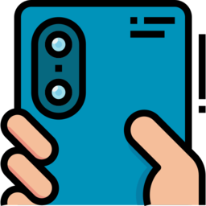

<!-- Copyright 2014 Signal Messenger, LLC -->
<!-- SPDX-License-Identifier: AGPL-3.0-only -->

  

# Observer Vault

> **Note:** This app is under development and hasn't been fully tested yet.

Observer Vault is a fork of [Signal Desktop](https://github.com/signalapp/Signal-Desktop).

Features:

- Stream video and audio from the Signal app on your phone to the Observer Vault app on your computer, end-to-end encrypted using Signal.
- Your footage is uploaded remotely to your computer immediately (saved in your Downloads folder), and it isn't saved to your phone.
- Send photos, videos, or other files as attachments using Signal to Observer Vault and it will store them in the Downloads folder on your computer.
- 30 second disappearing messages enforced.

It works like this.

You register a new Signal account within Observer Vault (you'll need an extra phone number), and then you'll keep it running on a computer somewhere safe, like at home. Or, have a trusted friend run Observer Vault for you from their home.

When you want to film ICE/DHS agents who are attacking and kidnapping your neighbors, open Signal and start a video call with your new Observer Vault Signal account. Observer Vault automatically accepts all calls and starts recording. When the call ends, Observer Vault will save the recording to your Downloads folder.

You can also take photos directly from the Signal app to send them to Observer Vault, without saving them in your phone's photo library. Observer Vault automatically downloads all attachments.

If the goons search your phone, they won't have access to the footage that you recorded. That's all saved remotely on the computer running Observer Vault.

## License

Signal Desktop is Copyright Signal Messenger, LLC.

Observer Vault is Copyright Lockdown Systems LLC.

Licensed under the GNU AGPLv3: https://www.gnu.org/licenses/agpl-3.0.html

Icon credit: [Nhor Phai from flaticons](https://www.flaticon.com/free-icon/dual-camera_1813228?related_id=1813206)
