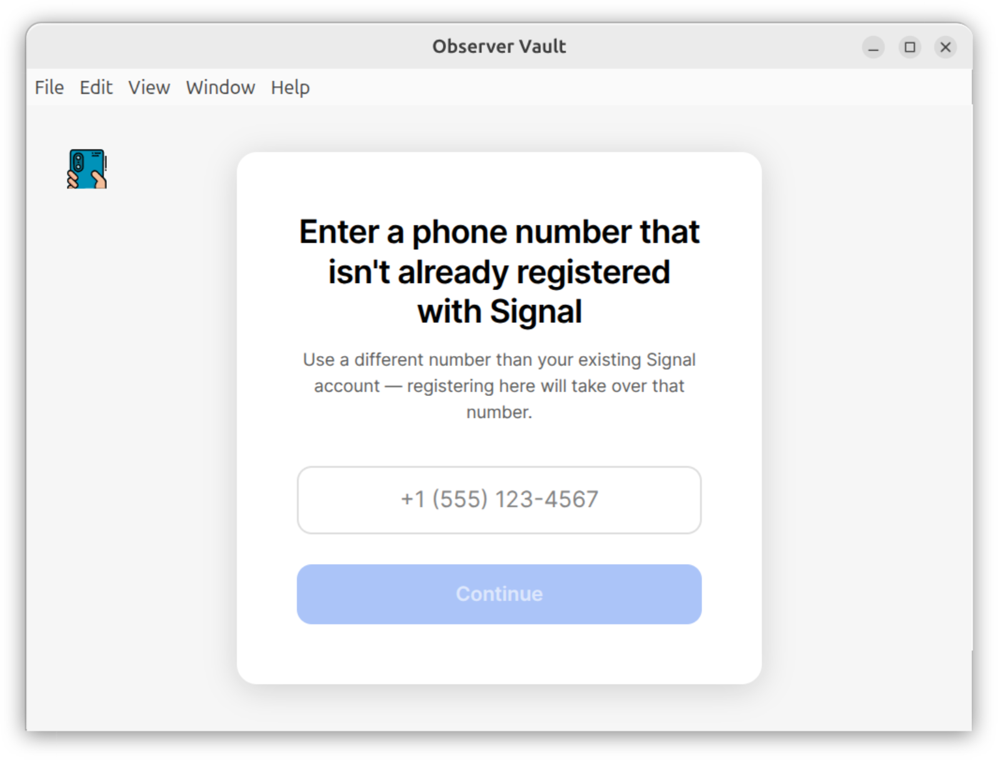
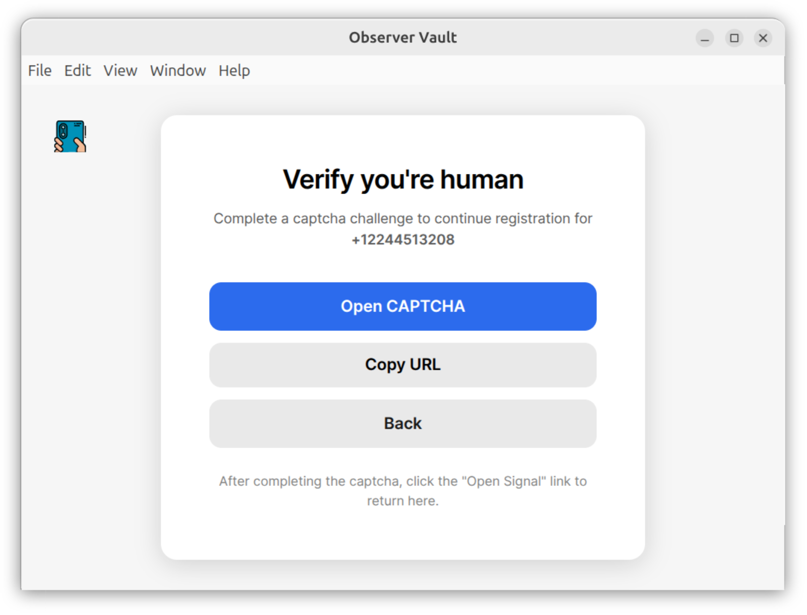
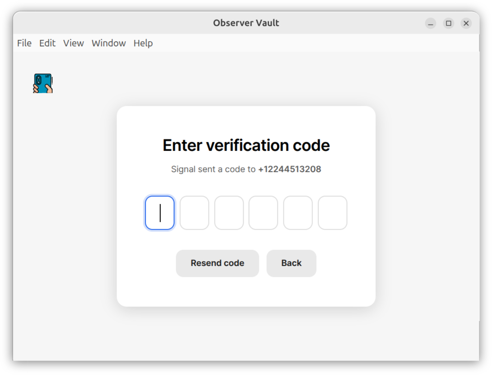
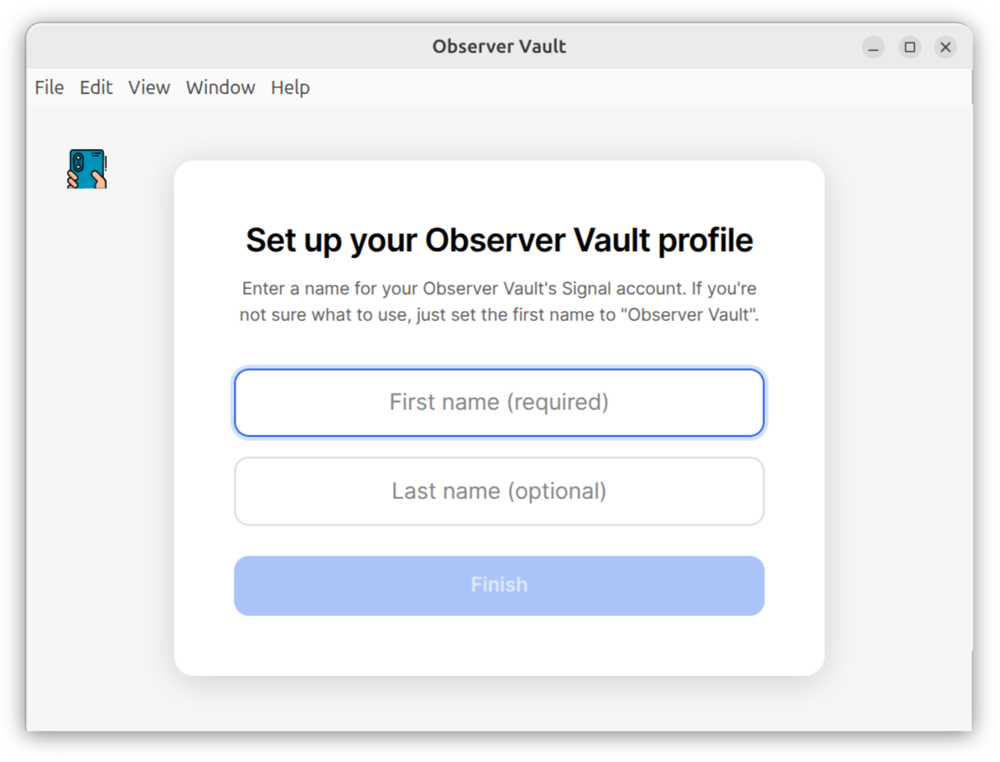
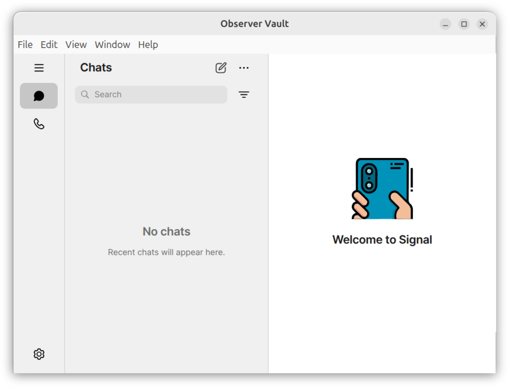

# Create an account

When you open Observer Vault for the first time, you'll be prompted to enter a phone number that isn't already registered with Signal. _Don't enter your normal phone number here._

Here's what it looks like:

Observer Vault is a Signal bot that needs its own separate Signal account, which requires a separate phone number. You and others will be using your main Signal accounts to save evidence to it.

## Get a separate phone number

Here are a few options:

- [Google Voice](https://workspace.google.com/products/voice/): If you live in the US, your Google account comes with a free Google Voice phone number.
- [SMS Pool](https://www.smspool.net/): A consmer-oriented service for buying cheap phone numbers for SMS verification.
- [Vonage](https://www.vonage.com/): A developer-oriented service for buying cheap virtual phone numbers.

Once you have a separate phone number, enter it into Observer Vault and click **Continue**.

## Solve the CAPTCHA

After entering your phone number, you'll be prompted to verify that you're a human by solving a CAPTCHA to finish creating your account. Here's a screenshot:

Click **Open CAPTCHA** or **Copy URL** to open a link in your browser. You'll need to solve an annoying CAPTCHA, and then it will open Observer Vault again.

## Verify the phone number

Signal will then send your separate phone number a text message with a 6-digit code. Check for new SMS messages on your separate phone, and enter the code here. Here's a screenshot:

After verifying your phone number, Observer Vault will spend a few seconds generating encryption keys and registering with the Signal service.

## Set up your profile

The last step is to create a Signal profile for your new Observer Vault bot. It will ask you to enter a name. This is the name that observers will see when they communicate with your bot over Signal. It looks like this:

## All done

Congratulations, you've set up Observer Vault! It should look almost identical to Signal Desktop. Here's a screenshot.

From within Observer Vault, send a Signal message to yourself, as well as to anyone else who might use your Observer Vault bot, to intiate conversations.
