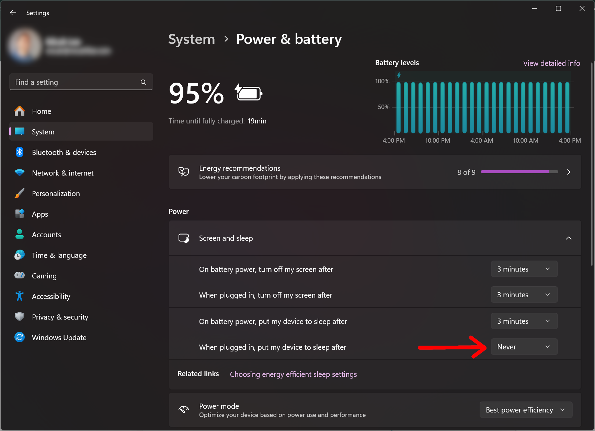
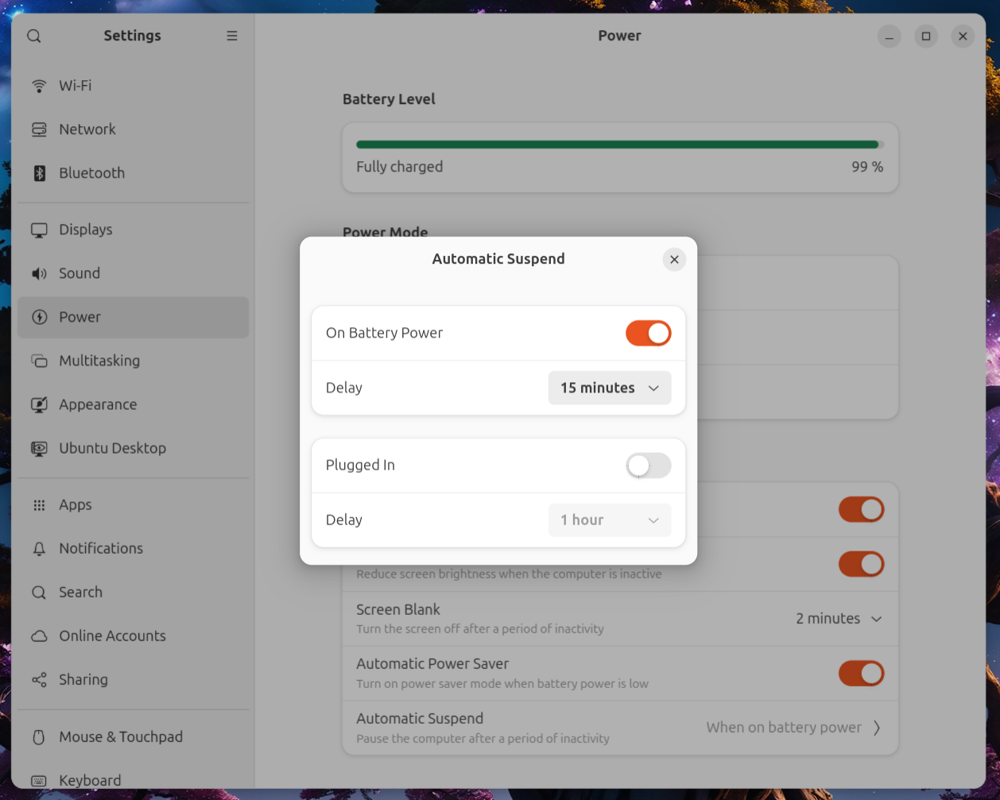

# Instructions for bot operators

Here are some things to keep in mind when you're running Observer Vault.

## When to run Observer Vault

If you're playing an offsite support role for a protest or action, you should consider running an Observer Vault bot for the people who will be there.

Similarly, if you have friends who live in a place that's under occupation by ICE, the military, Israel Defense Force, etc., you should consider running a bot for the people on the ground.

You also might want to run an Observer Vault bot for yourself, so that you can easily send yourself video, audio, or other attachments when you're away from home, without them staying on your phone.

## Run it on a computer that doesn't sleep

In order for Observer Vault to be available to answer calls and download attachments, it needs to be running on a computer that's powered on, connected to the internet, and not suspended. This is a great use for an extra old laptop that might be lying around.

If you're running Observer Vault on a laptop, keep it plugged in and keep the laptop lid open. Here's how to disable sleep for different operating systems.

### Disable sleep in Windows

Follow these instructions to prevent your computer from automatically going to sleep after being idle in Windows 11:

- Open the **Settings** app
- Click the **System** tab on the left panel
- Click **Power & battery**
- Expand **Screen and sleep**
- Make sure the settings include:
  - When plugged in, put my device to sleep after: **Never**

### Disable sleep in Mac

The simplest way to prevent your Mac from automatically going to sleep is to use [Caffeine](https://www.caffeine-app.net/), a tiny free and open source app.

Download and install Caffeine from https://www.caffeine-app.net/. When you run it, an empty coffee cup icon appears in the top-right of your menu bar. Click it (the icon changes to a cup full of hot coffee) and Caffeine will prevent your computer from sleeping. Click it again to disable it.

### Disable sleep in Linux

Follow these instructions to prevent your computer from automatically going to sleep after being idle in Ubuntu (the instructions should be similar in most Linux distributions):

- Open the **Settings** app
- Choose **Power** in the left panel
- Under **Power Saving**, click **Automatic Suspend**
- Make sure it's disabled under **Plugged In**

## Voice and video calls

When someone starts a Signal call with your Observer Vault bot, it will automatically answer the call. As soon as the call ends (the observer hangs on, the thug smashes their phone, etc.), a recording of the call will get saved to your `~/Downloads/ObserverVault/` folder.

:::tip
If you're not actively watching it, you might want to turn the volume down on your Observer Bot computer. Otherwise, when an observer calls and the bot answers, the audio from the call will play through your computer's speakers.
:::

## Images, videos, and file attachments

When someone sends your bot an attachment of any kind, Observer Vault will immediately save it to your `~/Downloads/ObserverVault/` folder.

## What do with the evidence you collect

You should defer to your local rapid response and mutual aid networks for how you want to handle it, but here are some general tips:

- **Consider trimming videos before doing anything with them.** When an observer starts a Signal call, there's a good chance they'll start it with their front-facing camera, and then switch cameras. You probably want to trim the first few seconds of the video, to remove the observer's face.
- **Share video with relevant lawyers.** For example, if an observer witnesses ICE kidnapping someone, try to get the video to the family of the victim and their lawyers.
- **Don't post stuff to social media until after you've reviewed it and decided that it's a good idea to post.** Viral videos of abuse by authorities can change hearts and minds. But always remember that the government monitors social media to learn the identities of their opposition.
- **If you have evidence of something damning, strategize with your community so that it will make the most impact.** It might be more powerful to initially distribute a video through a media outlet or a sympathetic politician than just posting it to Bluesky, for example.
- **If your footage doesn't capture anything that might help people, delete it.** Don't retain data that you don't need.
